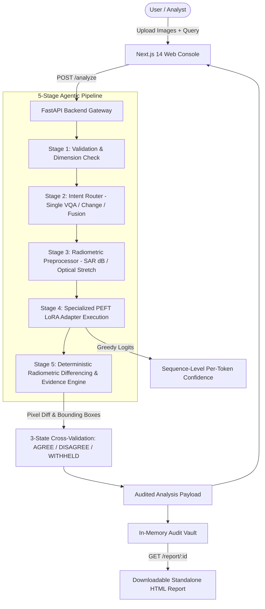

# SatQuery AI — Multimodal Remote-Sensing Intelligence Platform

[](https://www.python.org/)
[](https://fastapi.tiangolo.com/)
[](https://nextjs.org/)
[](https://huggingface.co/Qwen/Qwen2.5-VL-3B-Instruct)
[-green.svg)](#hardware-requirements--vram-budget)
[](#test-suite--verification)

> **SIH Problem Statement 26167:** Agentic Multimodal Vision-Language Model for Remote Sensing Imagery Analysis (Optical, SAR, and Bi-temporal Change Detection).

---

## 🛰️ Overview

**SatQuery AI** is an agentic, production-grade Vision-Language Model (VLM) system specifically designed for satellite and aerial imagery. Unlike generic models that hallucinate spatial relationships or fail on sensor-specific physics, SatQuery AI pairs a fine-tuned **Qwen2.5-VL-3B-Instruct** backbone with **deterministic radiometric evidence** and an **auditable 5-stage agentic trace**.

Every inference is auditable, cross-verified against ground-truth pixel physics, and exportable into an isolated, downloadable HTML/JSON report.

---

## 🏗️ Architecture



### 5-Stage Agentic Pipeline
1. **Compatibility Gate:** Asserts image integrity, dimensions, band count, and sensor compatibility.
2. **Intent Classifier:** Dispatches task routing (`single_vqa`, `single_caption`, `change_vqa`, `cross_modal`).
3. **Sensor-Aware Preprocessing:** Dynamically performs percentile stretching on optical imagery and decibel (`dB`) scaling on synthetic aperture radar (SAR).
4. **Specialized PEFT Inference:** Activates task-specific LoRA adapters (`adapter_a` for VQA/Dense Captioning; `adapter_b` for LEVIR-CD+ Bi-temporal Change).
5. **Deterministic Evidence Grounding:** Computes Otsu-free, threshold-based radiometric difference masks, cluster bounding boxes, and GeoJSON geometries.

---

## ✨ Key Innovations & Features

### 1. Dual LoRA Parameter-Efficient Adapters
* **Adapter A (VQA & Dense Captioning):** Trained on remote-sensing aerial imagery to identify infrastructure, terrain classes, vegetation density, and environmental context.
* **Adapter B (Bi-Temporal Change Detection):** Trained on the LEVIR-CD+ dataset, scoring **62.2% ±3.9 accuracy** and **0.469 macro-F1** on held-out test splits (vs. 12.7% degenerate always-yes baseline on unadapted models).

### 2. Deterministic Pixel-Level Visual Evidence
* **No Invented Geometry:** Many VLM architectures hallucinate coordinate tokens. SatQuery AI pairs neural reasoning with a deterministic spatial evidence engine.
* **Pixel Differencing:** Extracts real change regions with pixel bounding boxes, area statistics, and pixel-space GeoJSON.
* **3-State Cross-Check:** Automatically validates VLM text statements against pixel ground truth:
  * `AGREE`: Text claims change and pixel differencing confirms significant delta.
  * `DISAGREE`: Text claims change, but pixel differencing reveals 0.0% variance (or vice-versa).
  * `WITHHELD`: Query is non-assertive or single-image (no temporal differencing available).

### 3. Per-Token Sequence Confidence
* Calculates true mean top-1 sequence log-probabilities directly from decoder scores during generation (`compute_sequence_confidence`).
* Honest AI invariant: Clearly flagged with an explicit disclosure that raw confidence is model-internal and non-calibrated.

### 4. Zero-Mock Next.js 14 Operator UI
* Interactive dual-canvas swipe comparison slider for pre/post imagery.
* Toggleable bounding box overlays with hover tooltips and confidence chips.
* Collapsible 5-stage agent trace inspector.
* Export as standalone single-file HTML audit dossier.

---

## ⚡ Hardware Requirements & VRAM Budget

SatQuery AI is optimized to execute on **consumer laptop GPUs with 6GB VRAM** (such as NVIDIA GeForce RTX 4050 Laptop or RTX 3060 Laptop):

| Component | VRAM Footprint | Description |
|---|---|---|
| **Qwen2.5-VL-3B-Instruct (4-bit NF4)** | ~2.4 GB | Base weights loaded in 4-bit NormalFloat with bfloat16 compute |
| **Active LoRA Adapter** | ~0.3 GB | Low-rank matrices swapped dynamically in-memory |
| **Vision Embeddings (2 images)** | ~1.5 GB | Dynamic window: `min_pixels=50,176`, `max_pixels=200,704` |
| **FastAPI / PyTorch Context Headroom** | ~0.6 GB | CUDA graph allocations and cache |
| **Total Peak Consumption** | **~4.8 GB** | **Fits comfortably inside 6GB VRAM with ~1.2GB headroom** |

---

## 🚀 Quick Start Guide

### Prerequisites
* Windows 10/11 or Ubuntu Linux
* Python 3.10 or 3.11
* NVIDIA GPU with CUDA 12.x and $\ge 6$GB VRAM
* Node.js 18+ and npm

---

### Step 1: Backend Setup

```bash
# Clone the repository
git clone https://github.com/VectorVoidOrg/SatQueryAI.git
cd SatQueryAI/backend

# Create virtual environment
python -m venv venv
# On Windows:
venv\Scripts\activate
# On Linux:
# source venv/bin/activate

# Install dependencies
pip install -r requirements.txt

# Start the FastAPI server on GPU
uvicorn app:app --host 0.0.0.0 --port 8000
```

> **Note on Weights:** Adapter weights (`backend/artifacts/adapter_a` and `backend/artifacts/adapter_b`) should be placed in the `artifacts/` folder. For machines without a dedicated GPU, run `python dev_stub_server.py` from the root to run full pipeline tests with synthetic VLM responses.

---

### Step 2: Frontend Setup

```bash
cd ../frontend

# Install node dependencies
npm install

# Start development server
npm run dev
```

Open [http://localhost:3000](http://localhost:3000) in your browser.

---

## 🌐 Public Endpoint & Remote Tunneling

To connect a remote UI or run the backend from a local machine / cloud VM:

```bash
# Option A: Cloudflare Quick Tunnel (Free, no account needed)
cloudflared tunnel --url http://localhost:8000

# Option B: ngrok
ngrok http --url=https://capacity-property-vegan.ngrok-free.dev 8000


# Option C: Kaggle GPU Notebook Serving
# Open and run `backend/host_on_kaggle.ipynb` to host on free Kaggle T4/P100 GPUs
```

Set the public URL in `frontend/.env.local`:
```env
NEXT_PUBLIC_API_URL=https://capacity-property-vegan.ngrok-free.dev
```

---

## 🧪 Test Suite & Verification

The repository includes comprehensive test suites spanning both the backend processing engine and frontend component contracts:

```bash
# Run all 13 test suites (775 checks, CPU-only verification)
bash satquery/tests/run_all.sh

# Run backend-only test suite (223 checks)
bash backend/tests/run_tests.sh
```

Key test coverage:
* Synthetic bounding box recovery verification (injected $40 \times 40$ rectangle recovered at exact coordinates).
* Dynamic range percentile stretch and SAR decibel formula accuracy.
* Sequence confidence calculator edge cases and EOS handling.
* End-to-end HTTP payload validation for `/analyze` and `/report`.

---

## 📡 API Reference

### `POST /analyze`
Analyzes single or bi-temporal satellite imagery.

* **Content-Type:** `multipart/form-data`
* **Parameters:**
  * `query` (str): Question or directive (e.g., *"Identify changes between image 1 and image 2"*).
  * `file_pre` (file, required): First temporal image or single optical/SAR capture.
  * `file_post` (file, optional): Second temporal image for change analysis.
  * `timestamp_pre` (str, optional): ISO timestamp for image 1.
  * `timestamp_post` (str, optional): ISO timestamp for image 2.

**Sample Response:**
```json
{
  "report_id": "rep_a982f1b8",
  "answer": "Yes, significant infrastructure development is observed. Two new commercial buildings and an access road have been constructed in the north-east sector.",
  "task": "change_vqa",
  "adapter_used": "adapter_b",
  "confidence": 0.884,
  "confidence_disclosure": "Model-internal sequence score; not a calibrated correctness probability.",
  "evidence": {
    "changed_pixel_ratio": 0.0784,
    "cross_check": "AGREE",
    "bounding_boxes": [
      {"x1": 120, "y1": 45, "x2": 210, "y2": 115, "area": 6300}
    ],
    "overlay_png_base64": "data:image/png;base64,..."
  },
  "agent_trace": [
    {"stage": "1_validation", "status": "PASSED"},
    {"stage": "2_intent", "task": "change_vqa"},
    {"stage": "3_preprocess", "ops": ["optical_percentile_stretch"]},
    {"stage": "4_specialist", "adapter": "adapter_b"},
    {"stage": "5_evidence", "delta_ratio": 0.0784, "verdict": "AGREE"}
  ]
}
```

### `GET /report/{report_id}`
Returns a self-contained, downloadable HTML audit dossier with embedded visual evidence, complete trace metadata, and print-ready CSS. Append `?format=json` for raw machine-readable JSON.

---

## 🛡️ Stated Limitations & Scientific Honesty

In alignment with rigorous hackathon and academic evaluation standards, SatQuery AI explicitly declares its boundaries:

1. **Deterministic vs. Learned Grounding:** Visual bounding boxes are derived from verified radiometric differencing algorithms, not learned coordinate token heads. This guarantees zero hallucinated geometries.
2. **Pixel-Space Geometries:** Without CRS (Coordinate Reference System) metadata in user-uploaded PNG/JPG files, bounding boxes and GeoJSON outputs operate strictly in pixel space, not WGS84.
3. **Radiometric Sensitivity:** Differencing highlights surface reflectance variances; seasonal vegetation changes, solar azimuth shifts, and cloud cover may produce false-positive radiometric deltas.

---

## 📄 License

This project is licensed under the Apache 2.0 License.
